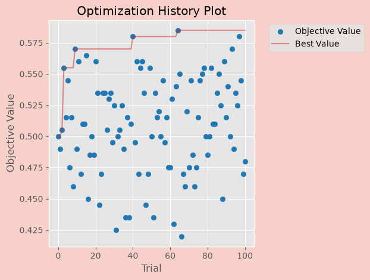
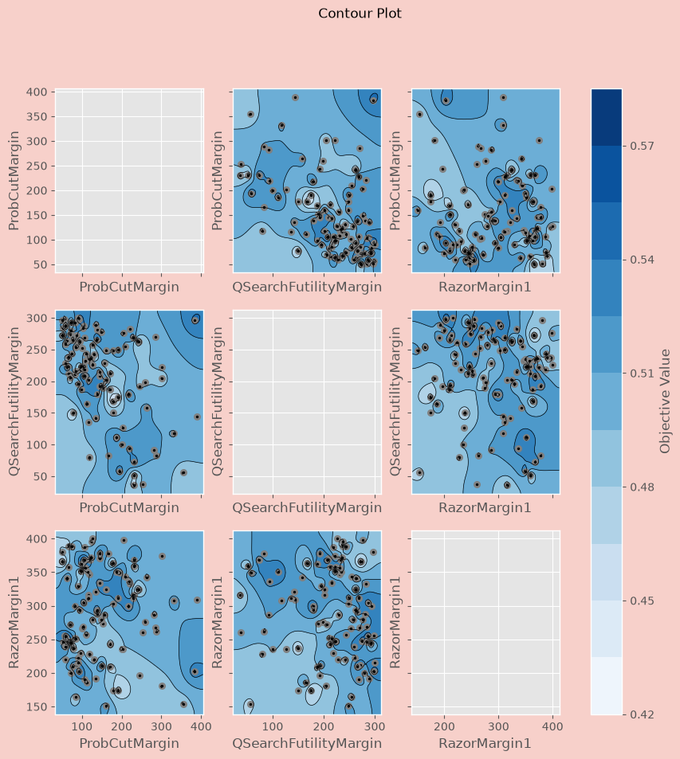

# Optuna Game Parameter Tuner

[](https://www.python.org/downloads/)
[](LICENSE)
[](#)
[](https://github.com/optuna/optuna)

Automatically tune the **evaluation and search parameters** of a game-playing engine
using the [Optuna](https://github.com/optuna/optuna) optimization framework.

The tuner repeatedly plays **engine-vs-engine matches** — a *test* engine using the
parameters suggested by the optimizer against a *base* engine using the current best
parameters — and feeds the match result (score rate or Elo) back to Optuna as the
objective. Over many trials it converges on stronger parameter values. It is primarily
aimed at chess engines (piece values, pruning margins, reduction factors, MCTS
constants, …) but works with any UCI/xboard engine and game variant whose tunable
options can be set on the command line.



---

## Table of contents

- [Features](#features)
- [How it works](#how-it-works)
- [Requirements](#requirements)
- [Installation](#installation)
- [Quickstart](#quickstart)
- [Match managers](#match-managers)
- [Defining parameters](#defining-parameters)
- [Objective: score rate vs Elo](#objective-score-rate-vs-elo)
- [Pruning unpromising trials](#pruning-unpromising-trials)
- [Samplers / optimizers](#samplers--optimizers)
- [Command-line reference](#command-line-reference)
- [Examples](#examples)
- [Plots & visualization](#plots--visualization)
- [Optuna dashboard](#optuna-dashboard)
- [Tools](#tools)
- [Project structure](#project-structure)
- [Optimization studies](#optimization-studies)
- [Credits](#credits)
- [License](#license)

---

## Features

- **Optuna-powered optimization** with [TPE](https://optuna.readthedocs.io/en/stable/reference/generated/optuna.samplers.TPESampler.html)
  and [CMA-ES](https://optuna.readthedocs.io/en/stable/reference/generated/optuna.samplers.CmaEsSampler.html) samplers.
- **Two objective types**: win/draw score rate (default) or **Elo** (`--elo-objective`).
- **Three match managers**: [cutechess-cli](https://github.com/cutechess/cutechess),
  [fastchess](https://github.com/Disservin/fastchess), and the bundled `duel.py`
  (xboard).
- **Resumable studies** — interrupt and continue later using the same `--study-name`
  (trials are stored in an SQLite database).
- **Trial pruning** with a threshold pruner to abandon clearly losing trials early.
- **Int and float parameters**, defined inline or from a **JSON / YAML file**.
- **Common parameters** applied to both engines (e.g. fixed `Hash`).
- **Time control or fixed depth/nodes** matches, with draw and resign adjudication.
- **CPU thread affinity** for fastchess (`--use-affinity`) to reduce result noise.
- **Plots** (history, contour, slice, parallel, importance) saved as PNG, plus live
  monitoring through the **optuna-dashboard**.

## How it works

1. Prepare the engine(s) and the parameters to optimize, and pick a trial budget.
2. Each trial plays a match between a **test** engine (optimizer-suggested params) and
   a **base** engine (the current best params; initially the defaults).
3. The match result — score rate `(wins + draws/2) / games` or Elo, from the test
   engine's point of view — is returned to Optuna. If the test engine is better, its
   params become the new best.
4. Optuna suggests the next parameter set and the loop repeats until the trial budget
   is reached (plots and a CSV summary are written automatically).
5. Re-running with the same `--study-name` resumes and extends the study.

## Requirements

- **Python 3.9, 3.10, or 3.11**

| Package           | Version  | Purpose                                            |
| ----------------- | -------- | -------------------------------------------------- |
| optuna            | 4.9.0    | Optimization framework (required)                  |
| optuna-dashboard  | 0.20.0   | Web dashboard to inspect trials (optional)         |
| pandas            | 2.3.3    | Save study results to CSV (optional)               |
| matplotlib        | 3.11.0   | Render plots as PNG (required for `--plot`)        |
| scikit-learn      | 1.9.0    | Parameter-importance plot (optional)               |
| cmaes             | 0.13.0   | CMA-ES sampler (optional, needed for `name=cmaes`) |

Install everything at once with `pip install -r requirements.txt`.

## Installation

```bash
git clone https://github.com/fsmosca/Optuna-Game-Parameter-Tuner.git
cd Optuna-Game-Parameter-Tuner

python -m venv venv
# Windows:
venv\Scripts\activate
# Linux/macOS:
source venv/bin/activate

pip install -r requirements.txt
```

A step-by-step Windows guide is available on the
[wiki](https://github.com/fsmosca/Optuna-Game-Parameter-Tuner/wiki/Windows-10-setup).

## Quickstart

Run a short study tuning a few Stockfish evaluation parameters at fixed depth, using
the bundled engine, opening book, and cutechess-cli:

```bash
python tuner.py ^
  --engine ./engines/stockfish-modern/stockfish.exe ^
  --opening-file ./start_opening/ogpt_chess_startpos.epd --opening-format epd ^
  --input-param "{'eMobilityBonus[2][10]': {'default':158, 'min':100, 'max':200, 'step':2}, 'mOutpost[0]': {'default':56, 'min':0, 'max':100, 'step':4}}" ^
  --depth 4 --games-per-trial 10 --trials 20 --concurrency 2 ^
  --study-name quickstart --pgn-output quickstart.pgn --plot
```

(`^` is the Windows line-continuation; use `\` on Linux/macOS.) This creates
`quickstart.db` (resumable study), `quickstart.pgn` (games), `quickstart.csv`
(results), and PNG plots in `visuals/`.

## Match managers

The tuner drives matches through an external **match manager**, selected with
`--match-manager`:

| Manager      | Value       | Engines     | Notes                                          |
| ------------ | ----------- | ----------- | ---------------------------------------------- |
| cutechess-cli| `cutechess` | UCI / xboard| Default. Windows `cutechess-cli.exe` bundled.  |
| fastchess    | `fastchess` | UCI only    | Fast, cutechess-compatible; supports affinity. |
| duel.py      | `duel`      | xboard      | Bundled pure-Python manager.                   |

### Choosing the executable

By default each manager looks for its binary in `tourney_manager/<manager>/` and then
on the `PATH`. Override the location with `--match-manager-file`, always **paired** with
the matching `--match-manager` flavor (the command syntax differs per manager):

```bash
# cutechess at a custom location (e.g. self-compiled on Linux)
--match-manager cutechess --match-manager-file /home/user/cutechess/cutechess-cli

# fastchess (no binary ships with this repo — supply your own)
--match-manager fastchess --match-manager-file C:/tools/fastchess/fastchess.exe

# duel.py in a custom location
--match-manager duel --match-manager-file /home/user/duel.py
```

Resolution order: `--match-manager-file` → `tourney_manager/<manager>/<binary>` →
binary on `PATH`. Passing `--match-manager-file` without `--match-manager` is an error,
since the flavor cannot be inferred from the path.

### fastchess thread affinity

fastchess can pin engine threads to specific CPU cores, which reduces variance in match
results. Use `--use-affinity` bare to auto-bind, or pass a core list/range:

```bash
--match-manager fastchess --use-affinity
--match-manager fastchess --use-affinity 3,5,7-11,13
```

`--use-affinity` is only valid with `--match-manager fastchess`, which is UCI-only
(it cannot run xboard/cecp engines).

## Defining parameters

### Inline

Each parameter is a dict with `default`, `min`, `max`, and `step`. Integers are assumed;
add `'type': 'float'` for floating-point parameters.

```bash
# integer parameters
--input-param "{'pawn': {'default':92, 'min':90, 'max':120, 'step':2}, 'knight': {'default':300, 'min':250, 'max':350, 'step':2}}"

# float parameters
--input-param "{'CPuct': {'default':2.147, 'min':1.0, 'max':3.0, 'step':0.05, 'type':'float'}}"
```

### From a JSON or YAML file

For larger sets, use `--input-param-file` instead of inline `--input-param` (define one
or the other). The file may be JSON (`.json`) or YAML (`.yaml`/`.yml`) with the
`name: {default, min, max, step}` structure; YAML also allows comments.

```yaml
# Search-margin tuning
RazorMargin1:          {default: 220, min: 150, max: 400, step: 1}
QSearchFutilityMargin: {default: 100, min: 50,  max: 200, step: 1}
CPuct:                 {default: 2.147, min: 1.0, max: 3.0, step: 0.05, type: float}
```

### Common parameters

Parameters that should be sent to **both** engines (and not optimized) — for example a
fixed transposition `Hash` — go in `--common-param` (or `--common-param-file`). Do not
repeat them in `--input-param`.

```bash
--common-param "{'Hash': 128, 'EvalHash': 4}"
```

### Unified config file (recommended)

Instead of spreading a run across many flags, describe the whole thing in one YAML (or
JSON) file and pass it with `--config`. A sample lives in
[`yaml_files/deuterium_config.yaml`](yaml_files/deuterium_config.yaml):

```bash
python tuner.py --config yaml_files/deuterium_config.yaml
```

The file has three sections:

| Section        | Holds                                                                 |
| -------------- | --------------------------------------------------------------------- |
| `input_param`  | the parameters to optimize (same structure as `--input-param-file`)   |
| `common_param` | fixed values sent to **both** engines (must not appear in `input_param`) |
| `options`      | everything else, keyed by the long flag name with underscores         |

```yaml
input_param:
  RazorMarginDepth1: {default: 220, min: 100, max: 400, step: 1}
  GoodEvalPruningMargin: {default: 60, min: 10, max: 150, step: 1}

common_param:
  Hash: 64

options:
  engine: ./engines/deuterium/deuterium.exe
  opening_file: ./start_opening/ogpt_chess_startpos.epd
  match_manager: cutechess          # --match-manager  -> match_manager
  trials: 20
  plot: true
  sampler: {name: tpe, multivariate: true, n_startup_trials: 6}
```

**Precedence:** any flag passed on the command line overrides the value in the config,
which in turn overrides the built-in default. So `--config deuterium_config.yaml --trials 5`
runs 5 trials regardless of what the file says. The boolean flags `--plot`,
`--elo-objective` and `--noisy-result` each have a `--no-*` counterpart
(`--no-plot`, `--no-elo-objective`, `--no-noisy-result`) so a config `true` can be turned
off for a single run. `sampler` and `threshold_pruner` are written as mappings here (not
the `key=value` form used on the command line). The older `--input-param-file` /
`--common-param-file` flags still work and take precedence over the config's sections.

## Objective: score rate vs Elo

By default the objective is the **score rate** `(wins + draws/2) / games` from the test
engine's point of view (`> 0.5` means the new parameters are winning). Add
`--elo-objective` to use **Elo difference** instead.

### Deterministic vs noisy matches

At **fixed depth**, replaying the same parameters with the same openings yields the same
result, so when a sampler re-suggests a parameter set the tuner reuses the previous
result instead of replaying. Under **time control** results are noisy, so add
`--noisy-result` to force a replay on repeated suggestions.

A sample trial log with `--elo-objective` and `--noisy-result`:

```text
starting trial: 149 ...
deterministic function: False
Duplicate suggestion from sampler, {'Pp2': 10, 'Pp6': 3}
Execute engine match as --noisy-result flag is enabled.
Actual match result: Elo 22.0, CI: [-75.9, +119.4], CL: 95%, G/W/D/L: 32/11/12/9, POV: optimizer
result sent to optimizer: 22.0
Trial 149 finished with value: 22.0 and parameters: {'Pp2': 10, 'Pp6': 3}. Best is trial 1 with value: 124.0.
```

## Pruning unpromising trials

`--threshold-pruner` stops a trial early when the partial match result is clearly
losing, saving time. Example with 100 games per trial:

```bash
--games-per-trial 100 --threshold-pruner result=0.45 games=50 interval=1
```

After the first 50 games, if the score is below `0.45` the trial is pruned and a new one
starts. Defaults: `result=0.25`, `games=games_per_trial/2`, `interval=1`. With
`--elo-objective` the `result` is expressed in Elo (e.g. `result=-10`).

## Samplers / optimizers

<a id="d-supported-optimizers"></a>

- **[TPE](https://optuna.readthedocs.io/en/stable/reference/generated/optuna.samplers.TPESampler.html)** (Tree-structured Parzen Estimator) — the default.
- **[CMA-ES](https://optuna.readthedocs.io/en/stable/reference/generated/optuna.samplers.CmaEsSampler.html)** (Covariance Matrix Adaptation Evolution Strategy).

```bash
--sampler name=tpe multivariate=true group=true n_startup_trials=6
--sampler name=cmaes sigma0=20 n_startup_trials=6
```

Run `python tuner.py -h` for the full list of per-sampler options.

## Command-line reference

Only the most common options are listed; run `python tuner.py -h` for the complete set.

### Required

| Option           | Description                                        |
| ---------------- | -------------------------------------------------- |
| `--engine`       | Engine path/filename (or `options.engine` in `--config`). |
| `--opening-file` | Opening start positions (pgn, fen, or epd; or `options.opening_file`). |
| `--input-param` / `--input-param-file` | Parameters to optimize (one is required, or the `input_param` config section). |

### Config

| Option     | Default | Description                                                  |
| ---------- | ------- | ------------------------------------------------------------ |
| `--config` | –       | One YAML/JSON file with `input_param`, `common_param` and an `options` section. CLI flags override it. |

### Match & time control

| Option              | Default | Description                                      |
| ------------------- | ------- | ------------------------------------------------ |
| `--match-manager`   | cutechess | `cutechess`, `fastchess`, or `duel`.           |
| `--match-manager-file` | –    | Custom path to the match-manager executable.     |
| `--use-affinity`    | off     | fastchess only: bind engine threads to CPU cores.|
| `--protocol`        | uci     | `uci` or `cecp` (xboard).                         |
| `--base-time-sec`   | 5       | Base time (s) for time-control matches.          |
| `--inc-time-sec`    | 0.05    | Increment (s) per move.                           |
| `--depth`           | –       | Fixed search depth (instead of time control).    |
| `--nodes`           | –       | Fixed node count (cutechess).                     |
| `--opening-format`  | pgn     | `pgn` or `epd`.                                   |
| `--concurrency`     | 1       | Games played in parallel.                         |

### Adjudication

| Option              | Default | Description                                      |
| ------------------- | ------- | ------------------------------------------------ |
| `--draw-movenumber` | –       | Moves before draw adjudication is considered.    |
| `--draw-movecount`  | 6       | Consecutive moves under the draw score.          |
| `--draw-score`      | 0       | Draw score threshold (cp).                        |
| `--resign-movecount`| –       | Consecutive moves under the resign score.        |
| `--resign-score`    | –       | Resign score threshold (cp).                      |

### Optimization & output

| Option              | Default | Description                                      |
| ------------------- | ------- | ------------------------------------------------ |
| `--trials`          | 1000    | Number of trials.                                |
| `--games-per-trial` | 32      | Games per trial (even number).                   |
| `--sampler`         | tpe     | `name=tpe` or `name=cmaes` (+ options).          |
| `--threshold-pruner`| off     | Prune losing trials early.                        |
| `--elo-objective`   | off     | Use Elo instead of score rate (`--no-elo-objective` to disable). |
| `--noisy-result`    | off     | Replay matches on repeated suggestions (`--no-noisy-result` to disable). |
| `--common-param` / `--common-param-file` | – | Params sent to both engines.       |
| `--study-name`      | default_study_name | Study/DB name (used to resume).       |
| `--direction`       | maximize| `maximize` or `minimize`.                        |
| `--variant`         | normal  | Game variant.                                    |
| `--pgn-output`      | optuna_games.pgn | Output PGN filename.                    |
| `--plot`            | off     | Save plots to `visuals/` (`--no-plot` to disable). |
| `--save-plots-every-trial` | 10 | Plot frequency (trials).                       |

## Examples

Ready-to-run batch files are in [`examples/`](examples):

| File | Description |
| ---- | ----------- |
| [`example1_optimizer_tpe.bat`](examples/example1_optimizer_tpe.bat) | TPE sampler, fixed depth, with threshold pruner. |
| [`example2_fastchess_tpe.bat`](examples/example2_fastchess_tpe.bat) | TPE via the fastchess manager with `--use-affinity`. |
| [`example3_musketeerchess_piecevalue_opt_tpe.bat`](examples/example3_musketeerchess_piecevalue_opt_tpe.bat) | Musketeer-chess piece-value tuning via the duel manager. |
| [`example4_optimizer_cmaes.bat`](examples/example4_optimizer_cmaes.bat) | CMA-ES sampler. |

## Plots & visualization

With `--plot`, the tuner writes plots to the [`visuals/`](visuals) folder every
`--save-plots-every-trial` trials, named `<study_name>_<trial><type>.png` where `type`
is one of `hist`, `contour`, `slice`, `parallel`, `importance`. Plots are rendered as
static PNGs via Optuna's matplotlib backend, so they work on headless Linux machines and
need no browser. (The importance plot requires scikit-learn.)



## Optuna dashboard

Trials can also be inspected live in the [optuna-dashboard](https://github.com/optuna/optuna-dashboard).
The study database is named `<study_name>.db`:

```bash
pip install optuna-dashboard
optuna-dashboard sqlite:///cdrill2000_razor_testpos.db
# Listening on http://127.0.0.1:8080/
```

Open `http://127.0.0.1:8080/` in your browser.


## Tools

Helper utilities for preparing opening books and analyzing results live in
[`tools/`](tools):

| Script | Description |
| ------ | ----------- |
| [`deduplicator.py`](tools/deduplicator.py) | Remove duplicate positions from an EPD/FEN opening file. |
| [`shuffler.py`](tools/shuffler.py) | Randomly shuffle the lines of a file (e.g. opening order). |
| [`filter.py`](tools/filter.py) | Filter musketeer-stockfish FENs by piece criteria. |
| [`getelo.py`](tools/getelo.py) | Compute Elo, error margins, LOS and draw ratio from W/L/D stats. |

## Project structure

```text
tuner.py             Main tuner script
requirements.txt     Python dependencies
engines/             Sample engines (deuterium, musketeer, stockfish-modern)
start_opening/       Opening books (epd/fen/pgn)
tourney_manager/     Match managers: cutechess/ (bundled), duel/, fastchess/
examples/            Example .bat command lines
yaml_files/          Sample unified run config (deuterium_config.yaml)
tools/               Opening-book and result utilities
visuals/             Generated plots
images/              README screenshots
```

## Optimization studies

- [Chess Piece Value Optimization](https://github.com/fsmosca/Optuna-Game-Parameter-Tuner/wiki/Chess-piece-value-optimization)
- [Chess Evaluation Positional Parameter Optimization](https://github.com/fsmosca/Optuna-Game-Parameter-Tuner/wiki/Chess-Evaluation-Positional-Parameter-Optimization)
- [Search Parameter Optimization](https://github.com/fsmosca/Optuna-Game-Parameter-Tuner/wiki/Search-Parameter-Optimization)
- [Optimization Performance Comparison](https://github.com/fsmosca/Optuna-Game-Parameter-Tuner/wiki/Performance-comparison)
- [TPE multivariate vs CMA-ES](https://github.com/fsmosca/Optuna-Game-Parameter-Tuner/wiki/Performance-comparison-between-tpe-multivariate-and-cmaes)

More help is on the [wiki](https://github.com/fsmosca/Optuna-Game-Parameter-Tuner/wiki/Help),
or run `python tuner.py -h`.

## Credits

- [Optuna](https://github.com/optuna/optuna) — optimization framework
- [cutechess](https://github.com/cutechess/cutechess) — match manager
- [fastchess](https://github.com/Disservin/fastchess) — match manager
- [scikit-learn](https://scikit-learn.org/stable/) — parameter importance
- [Stockfish](https://stockfishchess.org/) — sample engine

## License

Released under the [MIT License](LICENSE). Copyright (c) 2020 fsmosca.
